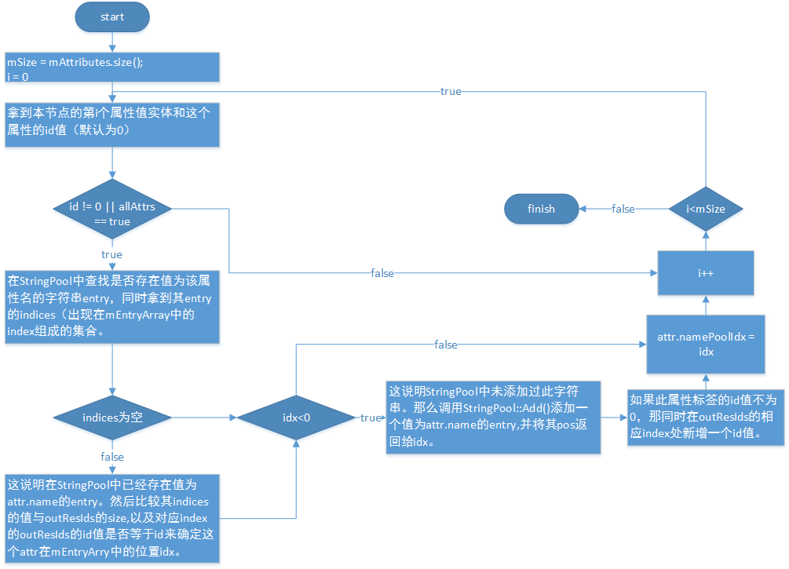
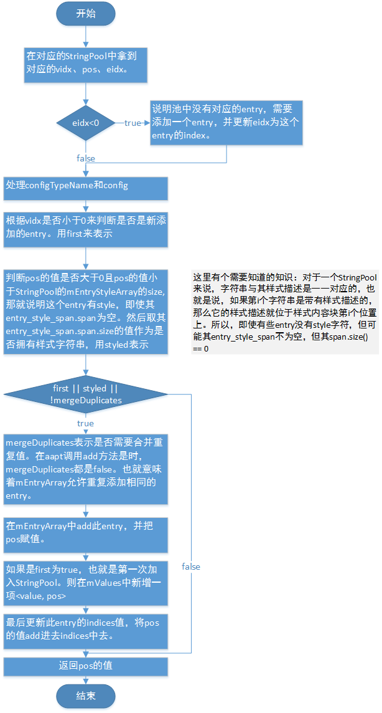

## Atlas-aapt   字符串资源池（StringPool）解析

这里对AndroidManifest.xml文件的字符串资源池的建立和收集做一个简要介绍。

###解析xml格式资源
xml格式的资源的解析代码在**XMLNode.cpp**中：
``` cpp
// 解析xml格式的资源文件
status_t parseXMLResource(const sp<AaptFile>& file, ResXMLTree* outTree,
                          bool stripAll, bool keepComments,
                          const char** cDataTags)
{
    // 将XML文件解析成一棵完整的XMLNode树，并返回其根节点
    sp<XMLNode> root = XMLNode::parse(file); 
    ...
    // 压平XML
    status_t err = root->flatten(rsc, !keepComments, false); 
    ...
    return NO_ERROR;
}
```

在**aapt**在处理**AndroidManifest.xml**文件（或其他xml格式的资源文件）时，会将其解析成一棵完整的**XMLNode**节点树，会将这棵**XMLNode**树的**root节点**返回。
此后**aapt**会将这棵树的所有节点收集到字符串，包括**命名空间名、节点名称、属性名称、属性值**等收集到一个类型为**StringPool**的字符串资源池中，而这个处理会在**压平（flatten）**整个XML文件的方法中完成。


``` cpp
// 压平xml资源文件
status_t XMLNode::flatten(const sp<AaptFile>& dest,
        bool stripComments, bool stripRawValues) const
{
    StringPool strings(mUTF8);
    Vector<uint32_t> resids;

    // 第一次String收集工作
    collect_resid_strings(&strings, &resids);

    // 第二次String收集工作.
    collect_strings(&strings, &resids, stripComments, stripRawValues);
    
    ...
}
```

####两次字符串的收集工作
在XMLNode.cpp的flatten()方法中,会首先创建一个编码格式为UTF-8的**StringPool**。然后对此根节点所在的XMLNode树进行**两次字符串收集工作**：
1. 对**已分配资源ID**的**属性名**进行收集。在完成本节点的收集后，会递归收集**子节点**符合要求的**属性名**；
2.  对**剩下的全部字符串**进行收集的工作,包括本节点的剩下的**属性名、命名空间名、节点名、注释**等字符串，然后再递归调用来完成对**子节点**的收集工作。

``` cpp
// 收集分配资源ID的XMLNode节点的属性名String
status_t XMLNode::collect_resid_strings(StringPool* outPool,
        Vector<uint32_t>* outResIds) const
{
    collect_attr_strings(outPool, outResIds, false);

    const int NC = mChildren.size();

    for (int i=0; i<NC; i++) {
        mChildren.itemAt(i)->collect_resid_strings(outPool, outResIds);
    }

    return NO_ERROR;
}
```

``` cpp
// 对剩下的全部字符串进行收集的工作
status_t XMLNode::collect_strings(StringPool* dest, Vector<uint32_t>* outResIds,
        bool stripComments, bool stripRawValues) const
{
    collect_attr_strings(dest, outResIds, true);

    ...
    // 收集本节点的命名空间、节点名、注释等字符串的操作
    ...

    // 如果此节点是一个纯文本CData节点，直接收集其节点所解析到的文件内容
    if (mElementName.size() == 0) {
        // If not an element, include the CDATA, even if it is empty.
        dest->add(mChars, true);
    }
    // 遍历子节点
    const int NC = mChildren.size();
    for (i=0; i<NC; i++) {
        mChildren.itemAt(i)->collect_strings(dest, outResIds,
                stripComments, stripRawValues);
    }

    return NO_ERROR;
}
```


这里虽然进行了两次收集工作，而且这两次收集工作都调用了**XMLNode::collect_attr_strings()**方法，但两次调用的**第三个参数**是存在差别。

```cpp
status_t XMLNode::collect_attr_strings(StringPool* outPool,
        Vector<uint32_t>* outResIds, bool allAttrs) const {
    const int NA = mAttributes.size();

    for (int i=0; i<NA; i++) {
        const attribute_entry& attr = mAttributes.itemAt(i);
        uint32_t id = attr.nameResId;
        if (id || allAttrs) {
            // See if we have already assigned this resource ID to a pooled
            // string...
            const Vector<size_t>* indices = outPool->offsetsForString(attr.name);
            ssize_t idx = -1;
            if (indices != NULL) {
                const int NJ = indices->size();
                const size_t NR = outResIds->size();
                for (int j=0; j<NJ; j++) {
                    size_t strIdx = indices->itemAt(j);
                    if (strIdx >= NR) {
                        if (id == 0) {
                            // We don't need to assign a resource ID for this one.
                            idx = strIdx;
                            break;
                        }
                        // Just ignore strings that are out of range of
                        // the currently assigned resource IDs...  we add
                        // strings as we assign the first ID.
                    } else if (outResIds->itemAt(strIdx) == id) {
                        idx = strIdx;
                        break;
                    }
                }
            }
            // 
            if (idx < 0) {
                idx = outPool->add(attr.name);
                if (kIsDebug) {
                    printf("Adding attr %s (resid 0x%08x) to pool: idx=%zd\n",
                            String8(attr.name).string(), id, SSIZE(idx));
                }
                if (id != 0) {
                    while ((ssize_t)outResIds->size() <= idx) {
                        outResIds->add(0);
                    }
                    outResIds->replaceAt(id, idx);
                }
            }
            attr.namePoolIdx = idx;
            if (kIsDebug) {
                printf("String %s offset=0x%08zd\n", String8(attr.name).string(), SSIZE(idx));
            }
        }
    }

    return NO_ERROR;
}
```

XMLNode::collect_attr_strings()方法的流程图如下：



在**collect_attr_strings()**方法中，如果**id == 0 && allAttrs == false**的时候，不会去执行属性名字符串的收集工作。而对于AndroidManifest.xml文件来说,在**startElement**处理器生成**Element**节点并收集节点的属性实体时，**XMLNode::addAttribute()**方法中并未对其attr.nameResId赋值，所以都为缺省0值。与此同时，在第一次收集工作调用时**allAttrs为false**，所以第一次收集工作**对AndroidManifest.xml文件来说，什么都没做**。


###StringPool的收集工作
上述**collect_attr_strings()**方法中，涉及到了大量和StringPool相关的方法以及属性，如果对这些相关知识不是很了解，那就很难理解这个方法到底做了什么。这里就对StringPool的相关知识做一个简要的介绍。

####StringPool类中的几个重要变量和内部struct
**StringPool**的具体定义在StringPool.h文件中,其是用来描述可以被解析成ResouceTypes的一种字符串池资源结构体。

```cpp
/**
 * The StringPool class is used as an intermediate representation for
 * generating the string pool resource data structure that can be parsed with
 * ResStringPool in include/utils/ResourceTypes.h.
 */
 class StringPool
```

其具有几个重要的内部对象和结构体，具体如下：

```cpp
// 用来描述一个StringPool中的字符串实体
struct entry {
        entry() : offset(0) { }
        ...
        // 此实体的字面值
        String16 value; 
        size_t offset;
        // 是否拥有样式
        bool hasStyles;
        // 在mEntryArray中出现的index的集合，也可以认为是add进此StringPool的index
        Vector<size_t> indices;
        String8 configTypeName;
        Vector<ResTable_config> configs;
        ...
    };


Vector<entry>                           mEntries;
Vector<size_t>                          mEntryArray;
Vector<entry_style>                     mEntryStyleArray;
DefaultKeyedVector<String16, ssize_t>   mValues;
```

这几个对象非常重要，对于理解StringPool是如何运作是很重要的。其具体含义如下：
- **mEntries** 按一定顺序排列的，在此StringPool中的entry的去重唯一集合。
- **mEntryArray** 按照mEntries中的顺序，每个add进这个StringPool的entry对应的index所形成的一个数组集合。一个entry可以被add多次，所以可能会在mEntryArray中出现相同的项。
- **mEntryStyleArray** 按照mEntryArray对应的顺序，所对应实体的样式集合。
- **mValues** 在StringPool中出现的字符entry的value与其在mEntryArray中第一次出现的所对应index所形成的key-value对。
- **entry.indices** 在mEntryArray中出现的index的集合，也可以认为是add进此StringPool的index组成的数组。

文字说明可能不是很清楚，这里举一个简单的列子：
有 A 、B、C、D四个字符串，按照ABCDAABDC的顺序add进一个新的StringPool中。
分析：
```cpp
string                     A B C D
string-index               0 1 2 3
add-value                  A B C D A A B D C
add-index                  0 1 2 3 4 5 6 7 8
add-string-index           0 1 2 3 0 0 1 3 2
```

我们假设生成的StringPool的中生成的entry顺序为A B C D，那么每个entry对应的eid（entryid）为 string-**index**所示，这也就是**mEntries**中entry对应的index。
按照**add-value**的顺序来添加到StringPool中，那么按照mEntries index的**add-index**数组则为 0 1 2 3 0 0 1 3 2，也就是**mEntryArray**的值。
再取出每个entry在**mEntryArray**中出现的index，组合成数组，就能得到每个entry的**indices**。
最后根据**mEntryArray**中每一个entry**第一次出现**的index，则可以得出**mValues**的值，其值为<A, 0>、<B, 1>、<C, 2>、<D, 3>。

所以，综上分析：
**mEntries**将有4个**entry**，分别如下
{value : A,  **indices** : {0, 4, 5}},
{value : B,  **indices** : {1, 6}},
{value : C,  **indices** : {2, 8}},
{value : D,  **indices** : {3, 7}}

**mEntryArray**为{0, 1, 2, 3, 0, 0, 1, 3, 2}

**mValues**为{(A, 0),  (B, 1),  (C, 2),  (D, 3)}
这样对照上面的说明就很容易知道每一个对象是用来做什么的。


###StringPool::add()方法
了解完上述对象的作用，现在可以来深入看下StringPool的add()方法。
StringPool的add()方法定义在StringPool.h中

```cpp
// 第二个方法最终也是调用了这个方法来实现的
ssize_t add(const String16& value, bool mergeDuplicates = false,
            const String8* configTypeName = NULL, const ResTable_config* config = NULL);

ssize_t add(const String16& value, const Vector<entry_style_span>& spans,
            const String8* configTypeName = NULL, const ResTable_config* config = NULL);
```

其具体实现在StringPool.cpp中：
```cpp
ssize_t StringPool::add(const String16& value, const Vector<entry_style_span>& spans,
        const String8* configTypeName, const ResTable_config* config)
{
    ssize_t res = add(value, false, configTypeName, config);
    if (res >= 0) {
        addStyleSpans(res, spans);
    }
    return res;
}
// StringPool最终调用的add方法
ssize_t StringPool::add(const String16& value,
        bool mergeDuplicates, const String8* configTypeName, const ResTable_config* config)
{
    ssize_t vidx = mValues.indexOfKey(value);
    ssize_t pos = vidx >= 0 ? mValues.valueAt(vidx) : -1;
    ssize_t eidx = pos >= 0 ? mEntryArray.itemAt(pos) : -1;
    if (eidx < 0) {
        eidx = mEntries.add(entry(value));
        if (eidx < 0) {
            fprintf(stderr, "Failure adding string %s\n", String8(value).string());
            return eidx;
        }
    }

    // 处理ConfigTypeName
    ...
    // 处理config
    ...
    
    const bool first = vidx < 0;
    const bool styled = (pos >= 0 && (size_t)pos < mEntryStyleArray.size()) ?
        mEntryStyleArray[pos].spans.size() : 0;
    if (first || styled || !mergeDuplicates) {
        pos = mEntryArray.add(eidx);
        if (first) {
            vidx = mValues.add(value, pos);
        }
        entry& ent = mEntries.editItemAt(eidx);
        ent.indices.add(pos);
    }

    if (kIsDebug) {
        printf("Adding string %s to pool: pos=%zd eidx=%zd vidx=%zd\n",
                String8(value).string(), SSIZE(pos), SSIZE(eidx), SSIZE(vidx));
    }

    return pos;
}
```

上述方法中的三个重要变量：
- **vidx**  指定value在此StringPool的**mValues**中的index
- **pos**   mValues中vidx所对应的项的值，也就是指定value所对应的enrty在**mEntryArray**中第一次出现的index
- **eidx**  pos所对应的**mEntryArray[index]**的值，也就是指定value所对应的enrty在**mEntries**的index。

该方法的简要流程图如下：


####回到XMLNode::collect_attr_strings()

所以我们在XMLNode::collect_attr_strings()中会有如下处理：
```cpp
 status_t XMLNode::collect_attr_strings(StringPool* outPool,
        Vector<uint32_t>* outResIds, bool allAttrs) const {
    for (int i=0; i<NA; i++) {
            ...
            if (idx < 0) {
                // 新增一个entry，并返回其pos，也就是mEntryArray中的index
                idx = outPool->add(attr.name);
                ...
            }
            // 将attr的namePoolIdx赋值为add()法返回的index,有了这个index,
            // 我们就能在StringPool中拿到对应的entry,为之后生成ResourceTypes做准备
            attr.namePoolIdx = idx;
            ...
        }
    }

    return NO_ERROR;
}
```

而对于XMLNode::collect_attr_strings()方法中indices!=null的情况，我们也可以看到其实aapt是去StringPool中查找已经添加的entry的pos。**这里我们也需要知道拥有资源ID的String，其在StringPool的index和其在outResIds中的index是一一对应的。**这里对pos的查找的条件稍微复杂，但可以归纳如下：

- 如果此时mEntryArray的**index** 大于 **outResIds.size()**且**entry.nameResId**值为0，则说明这个entry无需分配ResourceId，直接返回当前index.
- 如果此时mEntryArray的**index** 大于 **outResIds.size()**且**entry.nameResId**值不为0，由于aapt在为同一个字符串分配ID时，只会唯一的分配一次，所以可以忽略这种情况。
- 如果此时mEntryArray的**index** 小于 **outResIds.size()**且**entry.nameResId**与outResIds对应index上的值相等，则说明是当前的entry，直接返回当前index.

但由于目前在这里还只是简单的将字符串收集到StringPool中去，还**没有对特殊字符串分配ID**。所以其都是**默认缺省值0**，这里所有对资源ID都是==0的，且outResIds.size()也是== 0。这样的话，只要**entry.indices不为null**，这里都会直接走**第一种情况**，所以虽然在StringPool::add()方法参数mergeDuplicates == false，但这里对**相同的字符串也只会添加一次**。


到目前为止，就完成了对AndroidManifest.xml文件的StringPool的构建。这里收集到的StringPool是**没有分配ID的、去重的、**当前XMLNode树上所有字符串形成的字符串资源池/